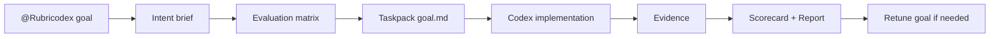

<div align="center">
  

  <h1>Rubricodex</h1>

  <p><strong>Codex 작업을 애매한 요청에서 검증 가능한 목표로 바꾸는 작은 harness</strong></p>

  <p>
    <a href="#codex-app에-설치"><strong>Codex app 설치</strong></a>
    ·
    <a href="#로컬-cli-설치-요청"><strong>CLI 설치 요청</strong></a>
    ·
    <a href="#빠른-시작"><strong>빠른 시작</strong></a>
    ·
    <a href="#어떻게-돌아가나"><strong>흐름</strong></a>
    ·
    <a href="#더-살펴보기"><strong>더 보기</strong></a>
  </p>

  <p>
    
    
    
  </p>
</div>

---

## 한 줄로 말하면

Rubricodex는 Codex에게 일을 맡기기 전에 **무엇을 만들지**, **어떤 기준이면 성공인지**, **무엇으로 검증할지**를 짧게 고정합니다.

그래서 Codex가 “다 된 것 같아요”라고 말하는 대신, 아래처럼 확인 가능한 결과를 남기게 합니다.

| Codex 작업에서 자주 생기는 문제 | Rubricodex가 고정하는 것 | 쉬운 뜻 |
| --- | --- | --- |
| 완료 기준이 흐림 | `intent brief` | 무엇을 만들지 한 장으로 정리 |
| 성공 기준이 중간에 바뀜 | `evaluation matrix` | 합격 기준표 |
| 검증 근거가 부족함 | `evidence` | 테스트, 파일, 결과 요약 |
| 실패 후 다음 지시가 장황함 | `retune instruction` | 다시 시도할 짧은 지시 |

> [!IMPORTANT]
> Codex app 플러그인 설치와 `rubricodex` CLI 설치는 서로 다릅니다.
> app에서 `@Rubricodex`를 쓰려면 Marketplace에 플러그인을 추가해야 하고,
> 터미널에서 `rubricodex ...` 명령을 직접 쓰려면 Python CLI도 설치해야 합니다.

## Codex app에 설치

첨부한 화면 기준으로는 Marketplace를 먼저 추가한 뒤, 그 안에서 Rubricodex 플러그인을 설치하면 됩니다.

1. Codex app 왼쪽/상단의 Marketplace 선택 메뉴를 엽니다.
2. `+ 더 추가`를 누릅니다.
3. `마켓플레이스 추가` 창에 아래 값을 넣습니다.

| 입력 칸 | 값 |
| --- | --- |
| 출처 | `https://github.com/jaehoonE7877/rubricodex` |
| Git ref | `main` |
| Sparse 경로 | `.agents/plugins`<br />`plugins/rubricodex` |

`Sparse 경로`는 한 칸에 아래처럼 줄바꿈해서 입력합니다.

```txt
.agents/plugins
plugins/rubricodex
```

4. `마켓플레이스 추가`를 누릅니다.
5. Marketplace 목록에서 Rubricodex를 찾아 설치합니다.
6. 새 Codex 작업에서 `@Rubricodex`를 멘션하거나, “Rubricodex로 이 요청을 bounded goal로 정리해줘”처럼 요청합니다.

CLI로 Marketplace만 추가하고 싶다면 같은 설정을 아래처럼 넣을 수 있습니다.

```bash
codex plugin marketplace add https://github.com/jaehoonE7877/rubricodex \
  --ref main \
  --sparse .agents/plugins \
  --sparse plugins/rubricodex
```

> [!NOTE]
> 위 명령은 Codex가 Rubricodex 플러그인을 찾을 수 있게 Marketplace를 등록합니다.
> 터미널에서 `rubricodex` 명령을 실행하는 Python CLI 설치는 다음 섹션을 따로 진행하세요.

## 로컬 CLI 설치 요청

로컬에서 artifact를 만들고 검증 명령을 직접 실행하려면 Python CLI가 필요합니다. 직접 명령을 따라가기보다, Codex에게 아래처럼 요청하면 현재 환경을 확인한 뒤 설치와 검증까지 맡길 수 있습니다.

```txt
Rubricodex 로컬 CLI를 이 GitHub repo 기준으로 설치해줘.
설치 절차는 docs/cli-install.md를 확인하고, Python 3.10+인지 확인한 뒤
editable install로 설치하고 `rubricodex --help`까지 검증해줘.
```

직접 설치하고 싶다면 [docs/cli-install.md](docs/cli-install.md)에 있는 명령을 그대로 따르면 됩니다.

설치하지 않고 repo 안에서 바로 실행할 수도 있습니다.

```bash
python3 -m rubricodex.cli --help
```

## 빠른 시작

가장 짧은 흐름은 `init`으로 작업 폴더를 준비하고, 자연어 목표를 `plan draft`로 압축하는 것입니다.

```bash
rubricodex init
rubricodex plan draft \
  --run-id example-v1.0 \
  --goal "관리자 dashboard page를 만들고 test evidence를 남겨줘."
```

v1.0.4에서는 코드 기반 평가표 제안과 고정 전 확인을 함께 켤 수 있습니다.

```bash
rubricodex plan draft \
  --run-id example-v1.0 \
  --goal "관리자 dashboard page를 만들고 test evidence를 남겨줘." \
  --propose \
  --review \
  --yes
```

설치하지 않은 상태라면 같은 명령을 Python module로 실행합니다.

```bash
python3 -m rubricodex.cli init
python3 -m rubricodex.cli plan draft \
  --run-id example-v1.0 \
  --goal "관리자 dashboard page를 만들고 test evidence를 남겨줘."
```

## 어떻게 돌아가나



쉽게 말하면, Rubricodex는 Codex에게 바로 “구현해줘”라고 던지지 않습니다.

| 단계 | 하는 일 | 결과물 |
| --- | --- | --- |
| 1 | 요청을 작고 명확한 목표로 정리 | `brief.json` |
| 2 | 성공 기준을 제안하고 확인 후 고정 | `evaluation-matrix.json` |
| 3 | Codex가 실행할 목표 파일 생성 | `goal.md` |
| 4 | 구현 후 검증 근거 초안·확정 | `evidence.draft.json`, `evidence.json` |
| 5 | 점수와 리포트 생성 | `scorecard.json`, `report.md` |
| 6 | 부족하면 다시 시도할 지시를 새 taskpack으로 발행 | `retune_goal.md`, `taskpacks/<run-id-rN>/goal.md` |

## 모드 선택

| Mode | 언제 쓰나 | 예시 |
| --- | --- | --- |
| `micro` | 아주 작은 수정 | 오타, 문구 변경 |
| `quick` | 작고 되돌리기 쉬운 작업 | 작은 버그 수정 |
| `standard` | 일반적인 제품 개발 | endpoint, 화면, 테스트 추가 |
| `strict` | 실수 비용이 큰 작업 | 결제, 권한, 개인정보, migration |
| `audit` | 구현 없이 검토만 할 때 | 현재 diff나 결과 리뷰 |

## 더 살펴보기

README는 설치와 핵심 흐름만 다루는 짧은 입구입니다. 세부 명령과 검증 절차는 아래 위치에서 확인합니다.

| 보고 싶은 것 | 위치 |
| --- | --- |
| app-first/local CLI 전체 fixture | [examples/source-code-endpoint](examples/source-code-endpoint) |
| 로컬 CLI 설치 명령 | [docs/cli-install.md](docs/cli-install.md) |
| CLI 명령 reference | [docs/cli-reference.md](docs/cli-reference.md) |
| Codex app plugin manifest, skill, icon assets | [plugins/rubricodex](plugins/rubricodex) |
| Rubricodex skill 사용 규칙 | [plugins/rubricodex/skills/rubricodex/SKILL.md](plugins/rubricodex/skills/rubricodex/SKILL.md) |
| Plugin lifecycle hook 결정 | [plugins/rubricodex/HOOKS.md](plugins/rubricodex/HOOKS.md) |

로컬 runner는 기본적으로 dry-run handoff만 기록합니다. 직접 Codex CLI 실행은 `--execute`를 명시할 때만 시도합니다.

## Product SSoT

제품 기준, roadmap, schema, CLI command, artifact 계약은 Notion에서 관리합니다.

- Notion Canonical SSoT: https://app.notion.com/p/3544408817af8182b23ecf3ba169d82e

이 repo에는 별도 SSoT mirror를 두지 않습니다. README는 짧은 입구이고, 상세 제품 기준은 Notion을 기준으로 합니다.
