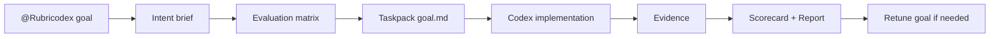

# Rubricodex

Rubricodex는 Codex app에서 `@Rubricodex`를 멘션해 모호한 구현 요청을 실행 가능한 작업으로 압축하는 output-quality harness입니다.

핵심은 절차를 늘리는 것이 아니라, Codex가 바로 놓치기 쉬운 **끝점**, **평가 기준**, **검증 근거**, **다음 수정 지시**를 가볍게 고정하는 것입니다.

## Why

| Codex 작업에서 자주 생기는 문제 | Rubricodex가 고정하는 것 |
| --- | --- |
| “완료”의 의미가 흐림 | intent brief |
| 성공 기준이 중간에 바뀜 | evaluation matrix |
| 검증 근거가 부족함 | evidence |
| 실패 후 다음 지시가 장황함 | retune instruction |

## Basic Flow



## Modes

| Mode | 언제 쓰나 |
| --- | --- |
| `micro` | 오타, 작은 문구, 명확한 단일 수정 |
| `quick` | 작고 되돌리기 쉬운 버그/기능 수정 |
| `standard` | endpoint, 화면, 테스트 추가 같은 일반 제품 개발 |
| `strict` | 결제, 권한, 개인정보, migration, 데이터 무결성 |
| `audit` | 구현 없이 현재 diff나 결과 검토 |

## Local Usage

```bash
python3 -m rubricodex.cli init
python3 -m rubricodex.cli goal compile --run-id example-v0.1
python3 -m rubricodex.cli prompt lint --run-id example-v0.1
python3 -m rubricodex.cli matrix lock --run-id example-v0.1
python3 -m rubricodex.cli run local --run-id example-v0.1
python3 -m rubricodex.cli score compute --run-id example-v0.1
python3 -m rubricodex.cli report --run-id example-v0.1
```

Codex app plugin 표면은 [plugins/rubricodex](plugins/rubricodex)에 있습니다. 로컬 runner는 기본적으로 dry-run handoff만 기록하며, 직접 Codex CLI 실행은 `--execute`로 명시할 때만 시도합니다.

## Fixture

[examples/source-code-endpoint](examples/source-code-endpoint)는 `brief.json`, `evaluation-matrix.json`, `goal.md`, `goal.lock.json`, `run-manifest.json`, `evidence.json`, `scorecard.json`, `report.md`, `retune_goal.md`가 한 흐름으로 이어지는지 검증합니다.

## Product SSoT

제품 기준, roadmap, schema, CLI command, artifact 계약은 Notion에서 관리합니다.

- Notion Canonical SSoT: https://app.notion.com/p/3544408817af8182b23ecf3ba169d82e

이 repo에는 별도 SSoT mirror를 두지 않습니다. README는 짧은 입구이고, 상세 제품 기준은 Notion을 기준으로 합니다.
