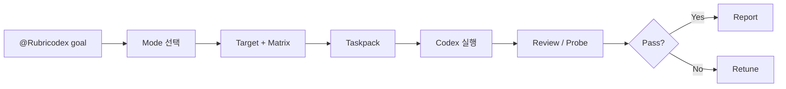

# Rubricodex

Rubricodex는 Codex app에서 `@Rubricodex`를 멘션해 모호한 구현 요청을 실행 가능한 작업으로 압축하는 output-quality harness입니다.

핵심은 절차를 늘리는 것이 아니라, Codex가 바로 놓치기 쉬운 **끝점**, **평가 기준**, **검증 근거**, **다음 수정 지시**를 가볍게 고정하는 것입니다.

## Why

| Codex 작업에서 자주 생기는 문제 | Rubricodex가 고정하는 것 |
| --- | --- |
| “완료”의 의미가 흐림 | target |
| 성공 기준이 중간에 바뀜 | evaluation matrix |
| 검증 근거가 부족함 | evidence |
| 실패 후 다음 지시가 장황함 | retune task |

## Basic Flow



## Modes

| Mode | 언제 쓰나 |
| --- | --- |
| `micro` | 오타, 작은 문구, 명확한 단일 수정 |
| `quick` | 작고 되돌리기 쉬운 버그/기능 수정 |
| `standard` | endpoint, 화면, 테스트 추가 같은 일반 제품 개발 |
| `strict` | 결제, 권한, 개인정보, migration, 데이터 무결성 |
| `audit` | 구현 없이 현재 diff나 결과 검토 |

## Example

```text
@Rubricodex quick 로그인 후 redirect query가 있으면 해당 경로로 이동하게 고쳐줘.
```

Rubricodex는 필요한 경우에만 짧게 묻고, 바로 실행 가능한 target/matrix/taskpack으로 압축합니다.

## v0.1 Fixture

첫 v0.1 proof fixture는 [examples/source-code-endpoint](examples/source-code-endpoint)에 있습니다. 실제 app plugin이나 CLI 자동화 없이도 `@Rubricodex` mention에서 target, matrix, taskpack, scorecard까지 이어지는 수동 품질 루프를 검증합니다.

## Product SSoT

제품 기준, roadmap, schema, CLI command, artifact 계약은 Notion에서 관리합니다.

- Notion Canonical SSoT: https://app.notion.com/p/3544408817af8182b23ecf3ba169d82e

이 repo에는 별도 SSoT mirror를 두지 않습니다. README는 짧은 입구이고, 상세 제품 기준은 Notion을 기준으로 합니다.
