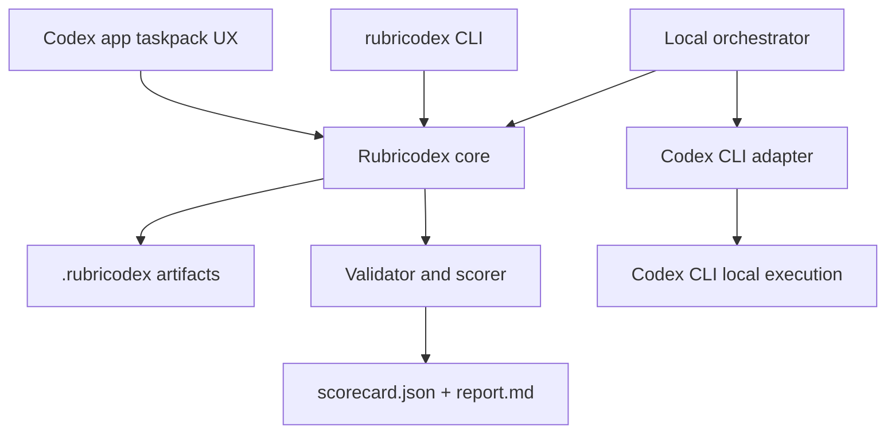
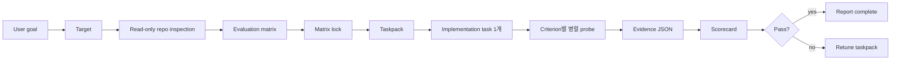

# Rubricodex SSoT

상태: v0.1 -> v1.0 로드맵 기준선  
대상 독자: Codex 초보자, harness engineering을 처음 도입하는 비개발자, v0.1부터 v1.0까지 구현할 엔지니어  
공식 제품명: Rubricodex  
공식 산출물 디렉토리: `.rubricodex/`


## 1. 제품 정의

Rubricodex는 Codex app과 Codex CLI를 위한 output-quality harness입니다. 목표는 Codex가 "작업을 했다"가 아니라 "원하는 끝점에 도달했고, 그 사실을 evidence로 설명할 수 있다"까지 가게 만드는 것입니다.

쉽게 말하면 Rubricodex는 Codex 작업을 위한 체크리스트, 실행 prompt, 검토 prompt, 결과 판정표를 만들어 주는 시스템입니다.

## 2. 핵심 원칙

1. Output quality가 platform completeness보다 우선입니다.
2. v0.1은 자동화보다 좋은 target, matrix, probe prompt를 먼저 증명합니다.
3. v1.0에서는 이 문서의 전체 harness 구조가 구현되어 있어야 합니다.
4. Raw transcript는 저장하지 않고, 요약된 evidence와 reference만 남깁니다.
5. Confidence는 report-only 값이며 pass/fail을 뒤집지 않습니다.
6. Matrix가 lock된 뒤에는 implementation이나 probe가 성공 기준을 바꾸면 안 됩니다.

## 3. 핵심 개념

| 개념 | 쉬운 의미 | v1.0 최종 형태 |
| --- | --- | --- |
| Target | 완료 상태에 대한 약속 | `.rubricodex/target.json` |
| Inspection | Matrix 전 read-only repo 조사 | `.rubricodex/inspection.json` |
| Matrix | 완료 여부를 판단하는 평가표 | `.rubricodex/matrix.json` |
| Matrix Lock | 성공 기준 고정 | `.rubricodex/matrix.lock.json` |
| Taskpack | Codex가 실행할 prompt 묶음 | `.rubricodex/taskpacks/<run_id>/` |
| Probe | 평가 항목 하나만 보는 read-only 검사 | criterion별 probe prompt/result |
| Evidence | 판단 근거 | local/CI artifact 우선 |
| Scorecard | 최종 판정표 | `.rubricodex/runs/<run_id>/scorecard.json` |
| Report | 사람이 읽는 결과 요약 | `.rubricodex/runs/<run_id>/report.md` |
| Retune | 실패 후 다음 실행 지시 | `.rubricodex/runs/<run_id>/retune/` |

## 4. v1.0 Target Architecture

v1.0에서는 아래 구조가 모두 구현되어 있어야 합니다.



v1.0 layer 책임:

| Layer | 책임 | 하면 안 되는 일 |
| --- | --- | --- |
| Core | artifact를 읽고 상태와 규칙을 검증 | Codex를 직접 호출 |
| CLI | command와 사용자-facing error 제공 | command handler 안에 핵심 규칙 숨기기 |
| Codex CLI adapter | Codex CLI 실행 방식과 flag 격리 | CLI 세부사항을 schema에 새기기 |
| Orchestrator | implementation 1개 실행, probe 병렬 실행, evidence 수집 | matrix나 SSoT를 임의 수정 |
| Scorer | hard gate, weighted score, warning, retune hint 계산 | 없는 evidence를 만들어내기 |
| Taskpack generator | Codex CLI/app prompt 생성 | prompt를 직접 실행 |

## 5. v1.0 End-to-End Workflow



## 6. Version Roadmap

### v0.1: Manual Quality Loop

목표: 자동화 없이도 Rubricodex가 output 완성도를 높인다는 것을 증명합니다.

포함:

- `target.json` 수동 작성 가이드
- `matrix.json` 수동 작성 가이드
- `taskpack.md` 단일 파일 생성 규칙
- `scorecard.md` 수동 판정 템플릿
- `examples/source-code-endpoint`의 pass/fail 예시

제외:

- Orchestrator
- Codex CLI 자동 호출
- 병렬 probe 자동 실행
- Matrix lock hash
- JSON Schema 전체 세트
- 상태 머신 구현

완료 기준:

- 사용자가 목표를 target으로 바꿀 수 있습니다.
- target을 4~8개 criterion으로 나눌 수 있습니다.
- Codex에게 줄 implementation prompt와 probe prompt를 만들 수 있습니다.
- 사람이 결과를 읽고 pass/fail/missing evidence를 scorecard로 기록할 수 있습니다.

### v0.2: Schema and Validation

목표: v0.1의 수동 artifact를 기계적으로 검증할 수 있게 만듭니다.

포함:

- `target.schema.json`
- `matrix.schema.json`
- `scorecard.schema.json`
- `rubricodex target validate`
- `rubricodex matrix validate`
- `rubricodex score validate`

제외:

- 자동 score 계산
- Codex CLI orchestration
- Taskpack directory 구조

완료 기준:

- 잘못된 target/matrix/scorecard를 명확한 error로 거절합니다.
- 예제 fixture가 validate command를 통과합니다.

### v0.3: Taskpack Generator

목표: 좋은 implementation/probe prompt를 일관되게 생성합니다.

포함:

- `rubricodex taskpack generate`
- `codex-app-taskpack` 출력
- `codex-cli-local` 출력 형식
- implementation prompt 1개
- criterion별 probe prompt

제외:

- Codex task 자동 실행
- Evidence JSON normalize

완료 기준:

- 같은 target/matrix에서 재현 가능한 taskpack이 생성됩니다.
- Codex 초보자도 taskpack을 보고 어떤 작업을 실행해야 하는지 이해할 수 있습니다.

### v0.4: Score Compute

목표: evidence를 사람이 읽는 수준에서 구조화하고 scorecard를 계산합니다.

포함:

- `evidence/<criterion_id>.json`
- `scorecard.json`
- `report.md`
- `rubricodex evidence validate`
- `rubricodex score compute`
- hard gate + weighted score
- confidence report-only 처리

제외:

- 병렬 probe 실행
- Codex CLI 자동 호출

완료 기준:

- pass fixture와 fail fixture가 모두 존재합니다.
- missing evidence가 report와 retune hint에 드러납니다.
- confidence가 pass/fail을 바꾸지 않습니다.

### v0.5: Matrix Lock and State Guardrails

목표: 성공 기준을 고정하고 실행 중 matrix drift를 막습니다.

포함:

- `matrix.lock.json`
- stable matrix hash
- `rubricodex matrix lock`
- lock 이후 matrix 변경 감지
- 최소 state model 검증

제외:

- 전체 state machine 자동 전이
- Codex CLI orchestration

완료 기준:

- matrix lock 이후 변경이 감지됩니다.
- implementation/probe task가 matrix를 바꾸지 못하도록 prompt와 validation이 막습니다.

### v0.6: Codex CLI Local Runner

목표: implementation task 1개를 Codex CLI로 실행하는 최소 runner를 만듭니다.

포함:

- Codex CLI adapter
- implementation prompt 실행
- changed files/commands summary 수집
- run manifest

제외:

- 병렬 probe 자동 실행
- automatic retune

완료 기준:

- Codex CLI flag 변경이 core schema에 새지 않습니다.
- implementation task가 1회 실행되고 결과 기준점이 기록됩니다.

### v0.7: Parallel Probe Runner

목표: criterion별 read-only probe를 병렬 실행합니다.

포함:

- criterion별 probe prompt 생성
- `--parallel N`
- read-only probe policy
- probe result normalize

제외:

- 복잡한 retry/cascade evaluator
- MCP evidence connector

완료 기준:

- probe가 source code를 수정하지 않습니다.
- criterion별 evidence JSON이 생성됩니다.
- 일부 probe 실패가 전체 run report에 명확히 표시됩니다.

### v0.8: Report and Retune Loop

목표: 실패한 output을 다음 실행으로 연결합니다.

포함:

- `report.md`
- `retune/retune.md`
- `retune/failed-criteria.json`
- 실패 criterion 중심 다음 taskpack

제외:

- 자동 재실행 loop
- Codex app 결과 자동 회수

완료 기준:

- 실패 원인이 criterion 단위로 설명됩니다.
- 다음 Codex 작업이 무엇인지 짧고 명확하게 생성됩니다.

### v0.9: Full Run Integration

목표: v1.0 직전의 전체 local run을 안정화합니다.

포함:

- `rubricodex orchestrate run`
- `rubricodex orchestrate status`
- `rubricodex orchestrate collect`
- `.rubricodex/runs/<run_id>/` 표준화
- network/evidence policy 검증

제외:

- SDK/API backend
- Codex app 자동 제출/자동 회수
- 외부 인터넷 evidence 기본 허용

완료 기준:

- source-code-endpoint 예제가 end-to-end로 실행됩니다.
- pass/fail/report/retune fixture가 모두 유지됩니다.

### v1.0: Complete Codex Harness

목표: 이 SSoT의 target architecture와 workflow가 모두 구현된 안정 버전입니다.

포함:

- v1.0 architecture 전체
- full `.rubricodex/` artifact directory
- target/inspection/matrix/taskpack/evidence/scorecard schema
- Codex app taskpack UX
- Codex CLI local orchestration
- implementation task 1개 자동 실행
- criterion별 parallel probe 자동 실행
- scorecard/report/retune 생성
- raw transcript 미저장
- local/CI artifact 중심 evidence policy

완료 기준:

- 사용자는 목표를 입력하고 Rubricodex를 통해 target, matrix, taskpack, implementation, probe, scorecard, report까지 이어갈 수 있습니다.
- v0.1에서 수동으로 하던 quality loop가 v1.0에서는 대부분 CLI와 taskpack으로 자동화됩니다.
- 그래도 성공 기준과 evidence는 사람이 읽고 검토할 수 있습니다.

## 7. v1.0 Artifact Directory

v1.0의 전체 artifact 구조입니다. v0.1부터 전부 만들지 않습니다.

```text
.rubricodex/
  config.json
  target.json
  inspection.json
  matrix.json
  matrix.lock.json
  taskpacks/
    <run_id>/
      manifest.json
      inspect.md
      implement.md
      review-all.md
      probes/
        <criterion_id>.md
        <criterion_id>.task.json
  runs/
    <run_id>/
      manifest.json
      scorecard.json
      report.md
      retune/
        retune.md
        failed-criteria.json
      evidence/
        <criterion_id>.json
      logs/
      transcripts/
      tmp/
```

기본 commit 대상:

- `.rubricodex/config.json`
- `.rubricodex/target.json`
- `.rubricodex/inspection.json`
- `.rubricodex/matrix.json`
- `.rubricodex/matrix.lock.json`
- `.rubricodex/runs/<run_id>/scorecard.json`
- `.rubricodex/runs/<run_id>/report.md`

기본적으로 commit하지 않을 것:

- `.rubricodex/runs/*/evidence/`
- `.rubricodex/runs/*/logs/`
- `.rubricodex/runs/*/transcripts/`
- `.rubricodex/runs/*/tmp/`
- raw chat transcript
- raw Codex task log
- redaction되지 않은 command output

## 8. v1.0 CLI Surface

v1.0에서 최종적으로 제공할 command입니다. 각 command는 roadmap 단계별로 점진 구현합니다.

```bash
rubricodex init --codex
rubricodex target brief --from prompt.md
rubricodex target validate
rubricodex inspect repo --backend codex-cli-local
rubricodex inspect validate
rubricodex matrix draft
rubricodex matrix validate
rubricodex matrix lock
rubricodex taskpack generate --run <run_id> --backend codex-cli-local
rubricodex taskpack generate --run <run_id> --backend codex-app-taskpack
rubricodex orchestrate run --run <run_id> --backend codex-cli-local --parallel 4
rubricodex orchestrate status --run <run_id>
rubricodex orchestrate collect --run <run_id>
rubricodex evidence validate --run <run_id>
rubricodex score compute --run <run_id>
rubricodex report --run <run_id>
rubricodex retune generate --run <run_id>
```

## 9. Score Model

Rubricodex는 hard gate와 weighted score를 함께 사용합니다.

v1.0 decision rule:

```json
{
  "minimum_total_score": 0.85,
  "fail_on_any_hard_gate": true,
  "confidence_is_report_only": true
}
```

Hard gate:

- 반드시 통과해야 하는 criterion입니다.
- 하나라도 실패하면 total score가 높아도 run은 실패합니다.
- 예: endpoint 존재, 보안, data integrity.

Weighted score:

- `0.0`에서 `1.0` 사이의 점수입니다.
- 각 criterion은 weight를 가집니다.
- Scorecard는 weighted criterion 결과를 합산합니다.

Confidence:

- Confidence는 report-only 값입니다.
- v0.1에서는 calibrated threshold를 정의하지 않습니다.
- Evidence가 부족하거나 confidence가 매우 낮으면 report warning 또는 manual review hint를 남깁니다.
- Missing evidence는 `needs_more_evidence`로 처리하며, 향후 fixture 결과를 쌓은 뒤 warning 기준을 보정합니다.
- Confidence는 fail을 pass로 바꾸지 않습니다.

## 10. Artifact Contract Examples

아래는 최종 JSON Schema가 아니라 구현을 위한 계약 예시입니다. 실제 schema는 roadmap에 따라 `cli/schemas/` 아래에 점진적으로 encode합니다.

### `target.json`

```json
{
  "schema_version": "0.1.0",
  "id": "source_code_endpoint",
  "kind": "source_code_change",
  "title": "Add POST /api/widgets endpoint",
  "endpoint": "POST /api/widgets",
  "done_when": [
    "The route accepts valid widget input.",
    "The route rejects invalid input.",
    "The route returns 201 with id, name, and status.",
    "Relevant automated tests pass."
  ],
  "in_scope": [],
  "out_of_scope": [],
  "constraints": [],
  "risk_flags": [],
  "unknowns": []
}
```

### `matrix.json`

```json
{
  "schema_version": "0.1.0",
  "target_id": "source_code_endpoint",
  "decision_rule": {
    "minimum_total_score": 0.85,
    "fail_on_any_hard_gate": true,
    "confidence_is_report_only": true
  },
  "criteria": [
    {
      "id": "endpoint_contract",
      "axis": "correctness",
      "type": "hard_gate",
      "weight": 0.2,
      "floor": 1.0,
      "observable": [
        "POST /api/widgets exists.",
        "Successful response uses status 201.",
        "Response includes id, name, and status."
      ],
      "evidence_required": [
        "endpoint source file",
        "test file",
        "test command result"
      ]
    }
  ]
}
```

### `scorecard.json`

```json
{
  "schema_version": "0.1.0",
  "run_id": "run-001",
  "target_id": "source_code_endpoint",
  "decision": "pass",
  "total_score": 0.91,
  "threshold": 0.85,
  "hard_gate_failures": [],
  "missing_evidence": [],
  "criterion_results": [
    {
      "criterion_id": "endpoint_contract",
      "status": "pass",
      "score": 1.0,
      "weight": 0.2,
      "weighted_score": 0.2,
      "confidence": 0.84
    }
  ],
  "retune_hints": []
}
```

## 11. First Example Fixture

첫 end-to-end fixture는 작고 이해하기 쉬워야 합니다.

```text
examples/source-code-endpoint/
  README.md
  package.json
  src/
    server.ts
    routes/
      health.ts
  tests/
    health.test.ts
  .rubricodex/
    target.json
    matrix.json
    scorecard.md
```

Example target:

```text
Add POST /api/widgets endpoint that:
- validates input
- creates a widget record
- returns 201 with id/name/status
- rejects invalid input
- has tests
```

추천 criteria:

| ID | Type | Axis | 의미 |
| --- | --- | --- | --- |
| `endpoint_contract` | Hard gate | Correctness | Endpoint가 존재하고 요구된 응답 형태를 반환 |
| `input_validation` | Hard gate | Correctness | 잘못된 input을 거부 |
| `data_integrity` | Hard gate | Reliability | 생성된 record가 안정적이며 fake-only가 아님 |
| `test_coverage` | Weighted | Verification | 관련 automated test가 있고 통과 |
| `maintainability` | Weighted | Design | 기존 route/test pattern을 따름 |
| `observability` | Weighted | Operations | error와 log가 최소한으로 유용함 |

## 12. Notion Documentation Plan

Notion에는 "앞으로 무엇을 추가 개발해야 하는가"를 사람이 빠르게 이해할 수 있게 정리합니다.

권장 Notion page:

- 제목: `Rubricodex v0.1 -> v1.0 Roadmap`
- 목적: Rubricodex가 output quality harness로 성장하는 단계별 개발 계획
- 포함 내용:
  - 제품 목표
  - v0.1부터 v1.0까지 단계별 기능
  - 각 단계의 완료 기준
  - v1.0에서 구현되어야 할 최종 architecture
  - Linear ticket 목록 링크

Notion은 상세 설명의 기준이고, Linear는 짧은 작업 추적의 기준입니다.

## 13. Linear Ticket Plan

Linear ticket은 사용자가 한눈에 현재 어떤 기능이 개발 중인지 알 수 있어야 합니다. 티켓 본문은 짧게 유지하고, 상세 설명은 Notion page로 연결합니다.

권장 ticket:

| Version | Ticket title | 핵심 내용 |
| --- | --- | --- |
| v0.1 | Manual quality loop 만들기 | target/matrix/taskpack/scorecard 수동 루프 |
| v0.2 | Schema validation 추가 | target/matrix/scorecard validate |
| v0.3 | Taskpack generator 만들기 | Codex app/CLI용 prompt 생성 |
| v0.4 | Score compute 추가 | evidence/scorecard/report 계산 |
| v0.5 | Matrix lock guardrail 추가 | matrix hash와 변경 감지 |
| v0.6 | Codex CLI local runner 추가 | implementation task 1회 자동 실행 |
| v0.7 | Parallel probe runner 추가 | criterion별 read-only 병렬 probe |
| v0.8 | Report and retune loop 추가 | 실패 원인과 다음 taskpack 생성 |
| v0.9 | Full local run 통합 | local orchestrate run/status/collect |
| v1.0 | Complete Codex harness 출시 | 전체 architecture와 workflow 완성 |

## 14. Maintenance Rules

- 제품 결정은 이 문서에 먼저 반영합니다.
- Schema, CLI command, example, taskpack은 이 문서에서 파생합니다.
- 경쟁하는 architecture/spec 문서를 만들지 않습니다.
- 새 파일에서는 legacy `Rubrix` 이름을 사용하지 않습니다.
- Raw chat transcript를 planning artifact로 저장하지 않습니다.
- 구현 중 이 문서와 실제 동작이 어긋나면, 같은 change에서 문서와 구현을 함께 맞춥니다.
