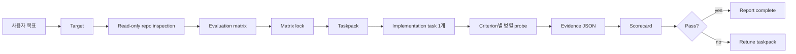
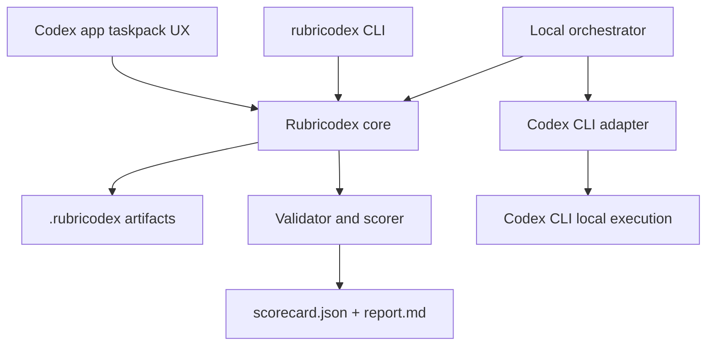
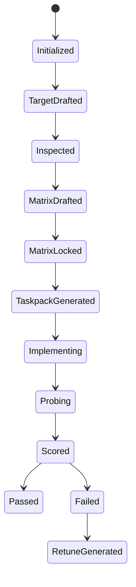

# Rubricodex SSoT

상태: v0.1 기획 기준선  
대상 독자: Codex 초보자, harness engineering을 처음 도입하는 비개발자, v0.1을 구현할 엔지니어  
공식 제품명: Rubricodex  
공식 산출물 디렉토리: `.rubricodex/`


## 1. 한 문장 정의

Rubricodex는 Codex app과 Codex CLI를 위한 harness입니다. 모호한 요청을 명확한 끝점, 평가 matrix, implementation taskpack, 병렬 probe, evidence 기반 scorecard로 바꿔서 "정말 끝났는가?"를 판단하게 합니다.

더 쉽게 말하면 Rubricodex는 Codex 작업을 위한 체크리스트와 증거 시스템입니다. 더 긴 프롬프트를 만드는 도구가 아니라, 구현 전에 "무엇을 만족해야 완료인가"를 먼저 고정하는 도구입니다.

## 2. 왜 필요한가

AI 코딩 작업은 모델이 약해서가 아니라, 요청이 측정 가능하지 않아서 실패하는 경우가 많습니다.

```text
"이 기능 만들어줘"
  -> 어떤 상태가 완료인지 모름
  -> 무엇을 검사해야 하는지 모름
  -> 테스트나 증거가 부족함
  -> 그럴듯하지만 애매한 결과가 나옴
```

Rubricodex는 작업을 바로 시작하지 않고 아래 순서를 강제합니다.

1. 끝점을 정의한다.
2. 끝점을 평가 항목으로 나눈다.
3. Codex가 실행할 implementation task를 만든다.
4. 평가 항목별로 read-only probe를 실행한다.
5. evidence를 모아 scorecard로 판정한다.

목표는 사람의 판단을 없애는 것이 아닙니다. 사람이 판단하기 쉽게 작업 결과를 구조화하는 것입니다.

## 3. v0.1 고정 결정

| 항목 | 결정 |
| --- | --- |
| 사용자 대상 | Codex app, Codex CLI |
| SDK/API backend | v0.1에서는 제외 |
| 기본 자동 실행 backend | `codex-cli-local` |
| Codex app 지원 방식 | `codex-app-taskpack` prompt 생성 |
| Implementation 실행 | run 하나당 implementation task 1개 |
| Probe 실행 | matrix criterion마다 read-only probe 1개, 병렬 실행 가능 |
| Matrix lock 전 repo 조사 | read-only ask-mode로 허용 |
| Artifact 구조 | `.rubricodex/` 아래에 분리 저장 |
| Score 방식 | hard gate + weighted score |
| Confidence | pass/fail에는 쓰지 않고 report에만 표시 |
| Raw transcript 저장 | 금지 |
| Evidence 저장 | 기본은 local 또는 CI artifact, 명시적으로 선택할 때만 commit |
| 첫 예제 domain | `examples/source-code-endpoint` |

이 repo의 공식 이름은 Rubricodex입니다. 예전 메모나 대화에 `Rubrix`가 나오더라도 새 구현에서는 `Rubricodex`, `.rubricodex/`, `rubricodex` 명령어로 번역해서 사용합니다.

## 4. 초보자를 위한 핵심 개념

Rubricodex에서 가장 중요한 단어는 다섯 개입니다.

| 개념 | 쉬운 의미 | 예시 |
| --- | --- | --- |
| Target | 완료 상태에 대한 약속 | "`POST /api/widgets` endpoint를 추가한다." |
| Matrix | 완료 여부를 판단하는 평가표 | endpoint, validation, 저장, test, error 처리 |
| Taskpack | Codex가 실행할 prompt 묶음 | implementation prompt 1개와 criterion별 probe prompt |
| Probe | 평가 항목 하나만 보는 read-only 검사자 | "input validation만 확인하고 파일은 수정하지 말 것" |
| Scorecard | 최종 판정표 | pass/fail, 점수, 부족한 evidence, 다음 action |

일반적인 Codex 요청은 "만들어줘"에서 시작합니다. Rubricodex 요청은 "무엇을 증명하면 만들었다고 볼 수 있는가?"에서 시작합니다.

## 5. Product Boundary

Rubricodex는 harness입니다. 모델 제공자, IDE, CI 시스템, hosted agent platform이 아닙니다.

Rubricodex가 책임지는 것:

- Target, matrix, taskpack, evidence, scorecard, report의 artifact 계약
- Artifact validate와 score 계산을 수행하는 CLI
- Codex CLI와 Codex app에 맞는 taskpack 생성
- Codex CLI를 통해 implementation 1개와 probe 여러 개를 실행하는 local orchestrator

v0.1에서 책임지지 않는 것:

- Codex SDK 또는 OpenAI API 실행 backend
- Codex app에 task를 자동 제출하고 결과를 자동 회수하는 기능
- Claude Code hooks 포팅
- Claude subagent 포팅
- Raw transcript 저장
- 외부 인터넷 자료를 기본 evidence로 사용하는 기능
- MCP evidence connector
- Confidence만으로 pass/fail을 결정하는 기능

## 6. 전체 Workflow



핵심은 matrix lock입니다. Matrix가 lock된 뒤에는 implementation이나 probe가 성공 기준을 몰래 바꾸면 안 됩니다.

## 7. Architecture

Rubricodex는 작고 명시적인 구조로 시작합니다.



| Layer | 책임 | 하면 안 되는 일 |
| --- | --- | --- |
| Core | artifact를 읽고 상태와 규칙을 검증 | Codex를 직접 호출 |
| CLI | command와 사용자-facing error 제공 | command handler 안에 핵심 규칙 숨기기 |
| Codex CLI adapter | Codex CLI 실행 방식과 flag 격리 | CLI 세부사항을 schema에 새기기 |
| Orchestrator | implementation 1개 실행, probe 병렬 실행, evidence 수집 | matrix나 SSoT를 임의 수정 |
| Scorer | hard gate, weighted score, warning, retune hint 계산 | 없는 evidence를 만들어내기 |
| Taskpack generator | Codex CLI/app prompt 생성 | prompt를 직접 실행 |

## 8. Artifact Directory

Rubricodex의 상태는 대화 기억이 아니라 repo 안의 구조화된 파일에 남습니다.

```text
.rubricodex/
  config.json
  target.json
  inspection.json
  matrix.json
  matrix.lock.json
  taskpacks/
    <run_id>/
      manifest.json
      inspect.md
      implement.md
      review-all.md
      probes/
        <criterion_id>.md
        <criterion_id>.task.json
  runs/
    <run_id>/
      manifest.json
      scorecard.json
      report.md
      retune/
        retune.md
        failed-criteria.json
      evidence/
        <criterion_id>.json
      logs/
      transcripts/
      tmp/
```

기본 commit 대상:

- `.rubricodex/config.json`
- `.rubricodex/target.json`
- `.rubricodex/inspection.json`
- `.rubricodex/matrix.json`
- `.rubricodex/matrix.lock.json`
- `.rubricodex/runs/<run_id>/scorecard.json`
- `.rubricodex/runs/<run_id>/report.md`

기본적으로 commit하지 않을 것:

- `.rubricodex/runs/*/evidence/`
- `.rubricodex/runs/*/logs/`
- `.rubricodex/runs/*/transcripts/`
- `.rubricodex/runs/*/tmp/`
- raw chat transcript
- raw Codex task log
- redaction되지 않은 command output

## 9. State Model



| State | 허용되는 다음 작업 |
| --- | --- |
| `TargetDrafted` | read-only repo inspection |
| `Inspected` | matrix draft |
| `MatrixDrafted` | matrix validate, matrix lock |
| `MatrixLocked` | taskpack generate |
| `TaskpackGenerated` | orchestration run |
| `Implementing` | source-code implementation task |
| `Probing` | 병렬 read-only probe task |
| `Scored` | report, retune 생성 |
| `Failed` | retune taskpack 생성 |
| `Passed` | 완료 |

Guardrail: `MatrixLocked` 이후에는 implementation task와 probe task가 `matrix.json`, `matrix.lock.json`을 수정하면 안 됩니다.

## 10. CLI Surface

v0.1 command는 작게 시작합니다. 목표는 거대한 platform이 아니라 artifact 계약을 증명하는 것입니다.

```bash
rubricodex init --codex
rubricodex target brief --from prompt.md
rubricodex target validate
rubricodex inspect repo --backend codex-cli-local
rubricodex inspect validate
rubricodex matrix draft
rubricodex matrix validate
rubricodex matrix lock
rubricodex taskpack generate --run <run_id> --backend codex-cli-local
rubricodex taskpack generate --run <run_id> --backend codex-app-taskpack
rubricodex orchestrate run --run <run_id> --backend codex-cli-local --parallel 4
rubricodex orchestrate status --run <run_id>
rubricodex orchestrate collect --run <run_id>
rubricodex evidence validate --run <run_id>
rubricodex score compute --run <run_id>
rubricodex report --run <run_id>
rubricodex retune generate --run <run_id>
```

| Command | 책임 |
| --- | --- |
| `target brief` | 사용자 목표를 structured target으로 변환 |
| `inspect repo` | matrix lock 전 read-only repo fact 수집 |
| `matrix draft` | target과 inspection을 기반으로 evaluation criteria 생성 |
| `matrix validate` | schema와 semantic completeness 검증 |
| `matrix lock` | matrix hash 생성, 성공 기준 고정 |
| `taskpack generate` | Codex CLI/app용 prompt 생성 |
| `orchestrate run` | implementation task와 probe task 실행 |
| `evidence validate` | probe evidence normalize 결과 검증 |
| `score compute` | hard gate와 weighted score 계산 |
| `report` | 사람이 읽을 수 있는 결과 생성 |
| `retune generate` | 실패 criterion 중심의 다음 작업 생성 |

## 11. Backend Policy

### `codex-cli-local`

v0.1의 primary backend입니다.

할 수 있는 일:

- matrix lock 확인
- Codex CLI로 implementation prompt 1개 실행
- criterion별 probe prompt 실행
- probe 결과를 evidence JSON으로 normalize
- scorecard와 report 계산

제약:

- Implementation task는 source code를 수정하고 test를 실행할 수 있습니다.
- Implementation task는 `matrix.json`, `matrix.lock.json`을 수정할 수 없습니다.
- Probe task는 read-only입니다.
- Probe task는 normalized evidence만 반환해야 합니다.
- Raw transcript는 저장하면 안 됩니다.

### `codex-app-taskpack`

Codex app에서 사람이 실행하거나 병렬 task로 나눠 쓰기 위한 prompt package입니다.

할 수 있는 일:

- Codex app에서 복사하거나 실행할 prompt 생성
- implementation prompt와 probe/review prompt 분리
- 사람이 Codex app에서 병렬 task를 돌리기 쉽게 구성

v0.1에서 하지 않는 일:

- Codex app에 task를 자동 제출
- Codex app 결과를 자동 회수
- SDK/API 실행에 의존

## 12. Orchestration Algorithm

`rubricodex orchestrate run --backend codex-cli-local`은 아래 순서로 동작합니다.

1. `config.json`, `target.json`, `matrix.json`, `matrix.lock.json`을 읽는다.
2. Matrix hash를 검증한다.
3. Run manifest를 만든다.
4. Implementation prompt를 만든다.
5. Codex CLI adapter를 통해 implementation task를 한 번 실행한다.
6. 구현 결과 기준점을 기록한다. 예: git diff hash, branch commit, workspace snapshot id.
7. Criterion마다 probe prompt를 하나씩 만든다.
8. `--parallel N` 기준으로 probe를 병렬 실행한다.
9. 각 probe 결과를 `evidence/<criterion_id>.json`으로 normalize한다.
10. Evidence를 validate한다.
11. Scorecard를 계산한다.
12. Report를 생성한다.
13. 실패하면 retune taskpack을 생성한다.

Implementation task 규칙:

- source code를 수정할 수 있습니다.
- matrix가 요구하는 test를 추가하거나 수정할 수 있습니다.
- 관련 command를 실행할 수 있습니다.
- `matrix.json`, `matrix.lock.json`은 수정하면 안 됩니다.

Probe task 규칙:

- source code를 수정하면 안 됩니다.
- matrix artifact를 수정하면 안 됩니다.
- 파일을 읽고 안전한 read/test command를 실행할 수 있습니다.
- evidence를 지어내면 안 됩니다.
- normalized evidence JSON만 반환해야 합니다.

## 13. Score Model

Rubricodex는 hard gate와 weighted score를 함께 사용합니다.

v0.1 추천 decision rule:

```json
{
  "minimum_total_score": 0.85,
  "fail_on_any_hard_gate": true,
  "confidence_is_report_only": true
}
```

Hard gate:

- 반드시 통과해야 하는 criterion입니다.
- 하나라도 실패하면 total score가 높아도 run은 실패합니다.
- 예: endpoint 존재, 보안, data integrity.

Weighted score:

- `0.0`에서 `1.0` 사이의 점수입니다.
- 각 criterion은 weight를 가집니다.
- Scorecard는 weighted criterion 결과를 합산합니다.

Confidence:

- Confidence는 report-only 값입니다.
- v0.1에서는 calibrated threshold를 정의하지 않습니다.
- Evidence가 부족하거나 confidence가 매우 낮으면 report warning 또는 manual review hint를 남깁니다.
- Missing evidence는 `needs_more_evidence`로 처리하며, 향후 fixture 결과를 쌓은 뒤 warning 기준을 보정합니다.
- Confidence는 fail을 pass로 바꾸지 않습니다.

## 14. Artifact Contracts

아래는 최종 JSON Schema가 아니라 v0.1 구현을 위한 계약 예시입니다. 실제 schema는 이후 `cli/schemas/` 아래에 별도로 encode합니다.

### `target.json`

```json
{
  "schema_version": "0.1.0",
  "id": "source_code_endpoint",
  "kind": "source_code_change",
  "title": "Add POST /api/widgets endpoint",
  "endpoint": "POST /api/widgets",
  "done_when": [
    "The route accepts valid widget input.",
    "The route rejects invalid input.",
    "The route returns 201 with id, name, and status.",
    "Relevant automated tests pass."
  ],
  "in_scope": [],
  "out_of_scope": [],
  "constraints": [],
  "risk_flags": [],
  "unknowns": []
}
```

### `inspection.json`

```json
{
  "schema_version": "0.1.0",
  "target_id": "source_code_endpoint",
  "mode": "read_only",
  "repo_findings": [
    {
      "kind": "file",
      "ref": "src/routes",
      "summary": "Existing route files live here."
    }
  ],
  "candidate_test_commands": ["npm test"],
  "open_questions": []
}
```

### `matrix.json`

```json
{
  "schema_version": "0.1.0",
  "target_id": "source_code_endpoint",
  "decision_rule": {
    "minimum_total_score": 0.85,
    "fail_on_any_hard_gate": true,
    "confidence_is_report_only": true
  },
  "criteria": [
    {
      "id": "endpoint_contract",
      "axis": "correctness",
      "type": "hard_gate",
      "weight": 0.2,
      "floor": 1.0,
      "observable": [
        "POST /api/widgets exists.",
        "Successful response uses status 201.",
        "Response includes id, name, and status."
      ],
      "probe": {
        "mode": "cli_command",
        "command": "npm test",
        "expected_exit_code": 0
      },
      "evidence_required": [
        "endpoint source file",
        "test file",
        "test command result"
      ],
      "anti_evidence": [
        "Endpoint exists only as a stub.",
        "Tests do not cover the new endpoint."
      ]
    }
  ]
}
```

### `evidence/<criterion_id>.json`

```json
{
  "schema_version": "0.1.0",
  "run_id": "run-001",
  "criterion_id": "endpoint_contract",
  "verdict": "pass",
  "score": 1.0,
  "confidence": 0.84,
  "evidence": [
    {
      "kind": "file",
      "ref": "src/routes/widgets.ts",
      "summary": "POST /api/widgets route implemented."
    },
    {
      "kind": "command",
      "ref": "npm test -- widgets",
      "exit_code": 0,
      "summary": "Widget endpoint tests passed."
    }
  ],
  "missing_evidence": [],
  "anti_evidence_found": []
}
```

### `scorecard.json`

```json
{
  "schema_version": "0.1.0",
  "run_id": "run-001",
  "target_id": "source_code_endpoint",
  "decision": "pass",
  "total_score": 0.91,
  "threshold": 0.85,
  "hard_gate_failures": [],
  "missing_evidence": [],
  "criterion_results": [
    {
      "criterion_id": "endpoint_contract",
      "status": "pass",
      "score": 1.0,
      "weight": 0.2,
      "weighted_score": 0.2,
      "confidence": 0.84
    }
  ],
  "retune_hints": []
}
```

## 15. Taskpack Design

Taskpack은 Codex가 해야 할 일을 명확히 분리합니다.

```text
.rubricodex/taskpacks/<run_id>/
  implement.md
  probes/
    endpoint_contract.md
    input_validation.md
    data_integrity.md
    test_coverage.md
```

`implement.md`는 아래 원칙을 포함해야 합니다.

```text
Read:
- .rubricodex/target.json
- .rubricodex/inspection.json
- .rubricodex/matrix.json
- .rubricodex/matrix.lock.json

Rules:
- Implement the target.
- Do not modify .rubricodex/matrix.json.
- Do not modify .rubricodex/matrix.lock.json.
- Add tests required by the matrix.
- Run relevant commands when possible.
- Report changed files and commands run.
```

`probes/<criterion_id>.md`는 아래 원칙을 포함해야 합니다.

```text
You are evaluating one Rubricodex criterion.

Read:
- .rubricodex/matrix.json
- .rubricodex/matrix.lock.json
- implementation diff or current branch
- relevant source and test files

Rules:
- Do not modify source code.
- Do not modify matrix artifacts.
- Do not invent evidence.
- Return normalized evidence JSON only.
```

## 16. Network and Evidence Policy

v0.1 기본 network policy:

```json
{
  "network": {
    "default": "off",
    "allow_external_evidence": false,
    "allowed_domains": []
  }
}
```

이유:

- 첫 `source-code-endpoint` 예제는 local repo fact만으로 충분해야 합니다.
- 외부 문서는 바뀔 수 있으므로 명시적으로 켜야 합니다.
- Evidence는 review 가능하고 범위가 작아야 합니다.
- Raw transcript는 민감한 맥락을 포함할 수 있으므로 저장하지 않습니다.

## 17. 첫 Example Fixture

첫 end-to-end fixture는 작고 이해하기 쉬워야 합니다.

```text
examples/source-code-endpoint/
  README.md
  package.json
  src/
    server.ts
    routes/
      health.ts
  tests/
    health.test.ts
  .rubricodex/
    config.json
    target.json
    inspection.json
    matrix.json
    matrix.lock.json
    runs/
      demo/
        scorecard.json
        report.md
```

Example target:

```text
Add POST /api/widgets endpoint that:
- validates input
- creates a widget record
- returns 201 with id/name/status
- rejects invalid input
- has tests
```

추천 criteria:

| ID | Type | Axis | 의미 |
| --- | --- | --- | --- |
| `endpoint_contract` | Hard gate | Correctness | Endpoint가 존재하고 요구된 응답 형태를 반환 |
| `input_validation` | Hard gate | Correctness | 잘못된 input을 거부 |
| `data_integrity` | Hard gate | Reliability | 생성된 record가 안정적이며 fake-only가 아님 |
| `test_coverage` | Weighted | Verification | 관련 automated test가 있고 통과 |
| `maintainability` | Weighted | Design | 기존 route/test pattern을 따름 |
| `observability` | Weighted | Operations | error와 log가 최소한으로 유용함 |

## 18. Implementation Roadmap

Phase 1: SSoT

- 이 문서를 canonical source로 유지합니다.
- 중복 architecture/spec 문서를 만들지 않습니다.
- Schema와 CLI behavior는 이 문서에서 파생합니다.

Phase 2: Schemas

- `cli/schemas/target.schema.json`
- `cli/schemas/inspection.schema.json`
- `cli/schemas/matrix.schema.json`
- `cli/schemas/taskpack.schema.json`
- `cli/schemas/evidence.schema.json`
- `cli/schemas/scorecard.schema.json`

Phase 3: Validator and Scorer CLI

- `rubricodex target validate`
- `rubricodex inspect validate`
- `rubricodex matrix validate`
- `rubricodex matrix lock`
- `rubricodex evidence validate`
- `rubricodex score compute`
- `rubricodex report`

Phase 4: Taskpack Generator

- `rubricodex taskpack generate --backend codex-cli-local`
- `rubricodex taskpack generate --backend codex-app-taskpack`

Phase 5: Codex CLI Orchestrator

- `rubricodex orchestrate run --backend codex-cli-local --parallel 4`
- `rubricodex orchestrate collect`

Phase 6: Example Fixture

- `examples/source-code-endpoint`
- pass/fail scorecard fixture
- evidence validation fixture
- report generation fixture

## 19. v0.1 Done Criteria

v0.1 완료 조건:

- 사용자가 target file을 만들 수 있다.
- Rubricodex가 target을 validate할 수 있다.
- Rubricodex가 matrix를 draft하고 validate할 수 있다.
- Rubricodex가 stable hash로 matrix를 lock할 수 있다.
- Rubricodex가 implementation/probe taskpack을 생성할 수 있다.
- Demo run이 valid evidence JSON을 생성할 수 있다.
- Score computation이 pass fixture와 fail fixture를 모두 만들 수 있다.
- Human-readable report가 결과를 설명한다.
- Raw transcript가 기본으로 저장되지 않는다.

## 20. SSoT Maintenance Rules

이 문서는 명시적인 새 versioned SSoT로 교체되기 전까지 제품 방향의 단일 기준입니다.

규칙:

- 제품 결정은 이 문서에 먼저 반영합니다.
- Schema, CLI command, example, taskpack은 이 문서에서 파생합니다.
- 경쟁하는 architecture/spec 문서를 만들지 않습니다.
- 새 파일에서는 legacy `Rubrix` 이름을 사용하지 않습니다.
- Raw chat transcript를 planning artifact로 저장하지 않습니다.
- 구현 중 이 문서와 실제 동작이 어긋나면, 같은 change에서 문서와 구현을 함께 맞춥니다.
